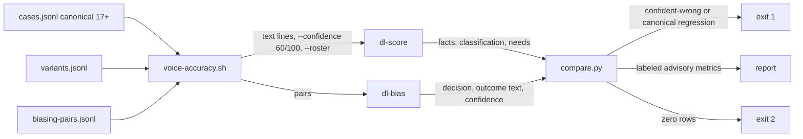
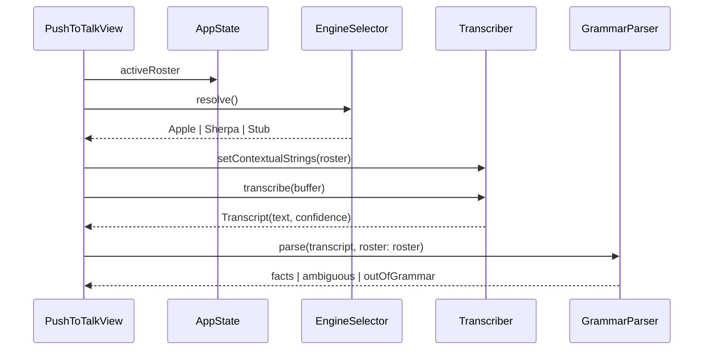

# Voice Accuracy Harness and Conservative Biasing - Plan

## Goal Capsule

- **Objective:** Anyone (human or agent) can run one command and get a labeled, reproducible answer to "does the deterministic pipeline ever score a plausibly mis-heard transcript as a *wrong* play silently, for mis-hearings detectable at the text layer (equivalent, ambiguous, filler, numeral, and roster-collision variants)?", and issue #157's roster-biasing pass can only ship if that answer is "never" on an adversarial corpus. A mis-hearing that is itself a different valid play is not detectable from text and is counted, not judged.
- **Means:** A headless fixture-robustness gate over the production `dl-score` pipeline, plus a pure, headlessly testable biasing decision that stays behind a measured-evidence policy (KTD1, KTD2, KTD4).
- **Authority hierarchy:** constitution Article VII and FR-008 (never a silent wrong play) > `evals/INTERFACE.md` labeling rules (§2.4) > this plan's Requirements > Key Technical Decisions > unit Approach text.
- **Stop conditions:** stop and surface if (a) the harness cannot be made to go red on a known-bad expectation (tripwire fails), (b) any adversarial biasing pair produces a confident-wrong override under the proposed policy and the policy cannot be tightened without making the pass vacuous, (c) the `evals/INTERFACE.md` bump would change an existing gate's semantics.
- **Execution profile:** two PRs (harness first, iOS wiring second); the synthetic-speech leg is a time-boxed spike that may be closed as a follow-up. Squad B (iOS/speech) with squad C review of the eval contract.
- **Who finishes and ships:** the implementing agent lands both PRs through `/ce-code-review`; a reviewer other than the authoring agent (squad C, as for the eval contract) reads the corpus expectations row by row before they are frozen (R9); the operator does the device verification and the Apple portal steps named in Scope Boundaries.

---

## Product Contract

### Summary

Build a CI-runnable voice-accuracy harness that drives transcript variants through the real `dl-score` pipeline and hard-fails only on the cardinal defect (a variant scores different facts *without* surfacing a clarify), reports everything else as labeled advisory metrics, and gates issue #157's roster-wired biasing pass, which is redesigned so it can only correct toward known vocabulary and cannot open the silent-scoring path until the harness has measured it.

### Problem Frame

Voice→score accuracy is the project's acknowledged biggest technical risk (ADR-0007, T076) and it is unmeasured. The only transcript-level coverage is the 17-case `evals/transcript-regression/cases.jsonl` regression gate, which proves canonical utterances score correctly but says nothing about mis-hearings, spoken numerals, filler words, or roster names.

Research established four facts that reshape the work:

1. The real ASR engine is not in the app's hot path. `ios/Sources/UI/PushToTalk/PushToTalkView.swift` still instantiates `StubTranscriber` with an empty buffer, and there is no microphone capture code. On-device voice accuracy cannot be measured by anyone until that wiring exists (T046).
2. Every production Apple transcript carries confidence 60, below the parser's threshold of 70, because iOS 26's `SpeechTranscriber` never reports a scalar confidence. So today every parseable play triggers the Clarify sheet (out-of-grammar utterances are rejected before confidence is consulted). Nothing scores silently, and nothing scores hands-free either.
3. Issue #157 as written is inert: its acceptance criterion "require a known base confidence to override" can never be satisfied on iOS 26. The only leg with a real confidence is the biased `SFSpeechRecognizer` pass.
4. The grammar is roster-blind. Player names are ignored unless they collide with a position keyword (a surname containing "right" maps to right field), and roster biasing makes names *more* likely to appear.

The harness therefore has to be honest about layers: what it can prove now is fixture robustness of the deterministic pipeline and the biasing decision, not field accuracy. The gold-game field-accuracy path (`evals/gold/`, `h3_ready`) stays a human handoff.

### Requirements

**Measurement**

- R1. The harness measures three layers per corpus row and reports each with the layer named: fact agreement (parsed facts equal expected), outcome agreement (`dl-score` classification, `needs`, judgment flag, Reisner catalyst equal expected), and, only when an ASR leg runs, transcript word error rate against the reference utterance.
- R2. The only hard-fail signal is confident-wrong, defined on `dl-score`'s actual output fields: a row with `ok == true` and `needs` of `none` or `confirm` whose facts differ from its expectation; a row that surfaces `judgment` when its base expectation is deterministic, or whose judgment kind differs from the base's expected kind; and a canonical row regressing against its frozen expectation.
- R3. Safe misses are variants that surface a parse rejection (`classification == parse_error` with an `error` starting `ambiguous(` or `out_of_grammar`) instead of scoring, or that surface the same judgment kind their base expects. They are counted and reported as advisory rates, never as failures.
- R4. Every report line that carries an accuracy-shaped number carries the label `FIXTURE ROBUSTNESS (advisory — not field accuracy)` or, for the synthetic-speech leg, `SYNTHETIC SPEECH (advisory — not field accuracy)`, per `evals/INTERFACE.md` §2.4.
- R5. The harness runs the corpus at the production default confidence (60) as well as at 100 and reports the clarify rate at each, defined as the share of parseable rows whose `error` starts `ambiguous(`. The confidence-60 run yields empty facts (the parser throws before the core), so it measures only that rate; fact and outcome agreement are measured at 100.
- R6. The harness runs the corpus twice and fails if the two outputs differ byte-for-byte (determinism, FR-003).

**Corpus**

- R7. The variant corpus references canonical cases by id and carries a variant transcript, a kind (`mishear`, `numeral`, `filler`, `roster`, `roster_collision`), an optional roster (required for the two roster kinds), and one of three expectations: "same facts as base", "must surface safely", or "text-layer undetectable" for a mis-hearing that is itself a different valid play. Undetectable rows are counted and reported under the R4 label and excluded from R2.
- R8. A biasing-pair corpus carries base text, biased text, biased confidence, the contextual set in force, and the expected decision (`override` or `keep_base`), including adversarial pairs a correct policy must refuse, among them in-vocabulary play-word swaps.
- R9. Expectations are authored from play semantics and frozen only after a reviewer other than the authoring agent has read the pipeline output row by row on a base that contains current `main` (Article XX); the reviewed commit and reviewer are recorded in the corpus README. No expectation is blessed by capturing output blind.
- R10. The corpus files are plain JSONL under `evals/voice-accuracy/` with a README that states what each tier can and cannot prove.

**Gate and contract**

- R11. The runner exits 0 on pass, 1 on any R2 failure or R6 divergence, 2 when it did no work (zero rows, missing binary on Darwin); on non-Darwin it prints a distinct SKIP marker and exits 0.
- R12. A tripwire test proves the runner exits 1 with a legible banner when fed a deliberately wrong expectation.
- R13. `evals/INTERFACE.md` is bumped to 1.2.0 with a §3.1 row for the new runner, its exit semantics, and the new labels; existing gate semantics are unchanged.
- R14. The runner is a hard CI gate on `macos-latest` and a `make` target; `transcript-score.sh` keeps its current behavior.
- R15. An ADR records the new gate tier, the `dl-score` CLI additions, and the biasing policy (Article XXXIV).

**Biasing (#157)**

- R16. The biasing decision is pure, Foundation-only, and lives in a target that builds on macOS so it is testable headlessly.
- R17. The biased hypothesis may replace the base hypothesis only when all hold: the biased leg reports a real confidence at or above the parser threshold, the token-level normalized edit distance between the two hypotheses is at or below 0.30, every differing token in the biased text is a member of the contextual set in force, and every base-side token the biased text replaces is absent from that set (only out-of-vocabulary words may be corrected; a swap of one known play word for another is refused). Set membership is over the whitespace tokens of each contextual phrase after normalization.
- R18. The base hypothesis is kept, with nil confidence, whenever any R17 condition fails; the P0b invariant "no override without a positive measurement" is preserved.
- R19. Biasing never lowers a known confidence; when the base leg reports a real confidence in a future SDK, the existing higher-confidence-wins rule applies on top of R17.
- R20. A silent-scoring policy switch, default off, caps the outcome confidence below the parser threshold so a biased correction improves the Clarify sheet's candidates without opening hands-free scoring. The switch may be flipped only on on-device measurement after T046; this harness produces no evidence for flipping it, and the product owner records the flip decision in ADR-0017.
- R21. The live push-to-talk path resolves its transcriber through `TranscriberEngineSelector` and calls `setContextualStrings` with the active game's roster before every transcribe.
- R22. The grammar parser accepts an optional roster and masks exact roster-name tokens before production matching so a surname can no longer collide with a position keyword.

### Key Decisions

- **Hard-fail on the cardinal invariant, not on an accuracy percentage.** A threshold would be a proxy the gate could pass while the real defect exists. Governs R2, R3, R11.
- **Label every accuracy number by what it proves.** Fixture robustness is not field accuracy; the label is the contract, not the number. Governs R4, R13.
- **Redesign #157's override rule around the biased leg's measured confidence plus agreement, instead of an unreachable base confidence.** The literal acceptance criterion would ship dead code; the principle is "the biased engine may correct words, never confidence". Governs R17, R18. (session-settled: user-directed — chosen over shipping #157's literal acceptance criterion: base confidence is nil forever on iOS 26, so the literal rule ships an inert pass; the R20 cap keeps silent scoring closed either way.)
- **Do not open hands-free scoring in this iteration.** Biasing corrects text behind a policy switch that stays off until device-measured evidence exists. Consequence: every voice play stays Clarify-pick plus Card A confirm (one phrase, two taps), so SC-005's one-tap bar and the ADR-0006 usability tripwire measured at T074 cannot pass while this holds. Flip condition: on-device measurement after T046, decided by the product owner and recorded in ADR-0017. Governs R20.
- **Roster lives UI-side for now.** The core's `LineupSlot` requires a fielding position the New Game screen does not collect, so threading the lineup through the core is deferred. Governs R21.

### Success Criteria

- Running the harness on the merged corpus reports zero confident-wrong rows and at least one safe miss per variant kind, proving both that the gate is armed and that the corpus exercises it.
- The tripwire demonstrably turns the gate red.
- The adversarial biasing pairs all resolve to `keep_base`; the corrective pairs all resolve to `override`.
- The reported clarify rate at confidence 60 is 100% of rows that parse (out-of-grammar rows are reported separately), before any biasing, and the plan's report makes that visible to the product owner.

### Scope Boundaries

**In scope:** the harness, corpus, runner, CI gate, interface bump, ADR, the pure biasing decision, roster wiring on the push-to-talk path, grammar roster masking, and a spike on a synthetic-speech leg.

**Not in scope:** microphone capture (T046), threading lineups into the Rust core, sequential full-game scoring in `dl-score` (ADR-0015 follow-up a), authoring the gold game's `narration.txt`, and any change to `core/`.

#### Deferred to Follow-Up Work

- **T046 microphone capture and real-engine push-to-talk.** Required before any on-device voice accuracy exists. This is the next plan after this one; the roster wiring here (R21) is written so it needs no change when capture lands.
- **Lineup through `CoreClient.createGame` into `Team.lineup`.** Agent-native parity for rosters; needs the New Game screen to collect positions first.
- **Gold-game `narration.txt` bridge and sequential `dl-score` mode** (ADR-0015 follow-ups a and b). Gives a 61-play sequential corpus that is still self-consistency until a human scores it.
- **Extract the ~50 utterances embedded in `ios/Tests/DL151GrammarHardeningTests.swift` into a shared fixture** so the tests and the corpus stop diverging.
- **Fix the advisory iOS `xcodebuild` CI job** by building the XCFramework before it runs; the runner image already has Xcode 26.

---

## Planning Contract

### Key Technical Decisions

- KTD1. **Drive the production pipeline through `dl-score`; extend it with `--confidence <int>` and `--roster <csv>` flags, defaults unchanged.** `dl-score` links the same `Parse` and `FactBridge` the app uses (ADR-0015), so the harness measures the real seam. Confidence is hard-coded to 100 today, which hides the FR-008 branch; the flag exposes it without changing default output. Output fields stay stable because `transcript-score.sh` diffs them.
- KTD2. **The biasing decision and text agreement move to `SpeechTypes`.** It is the Foundation-only, macOS-buildable layer already linked by `dl-score`. `DiamondSpeech`'s `BiasingStrategy` becomes a thin adapter over it. This is what makes R16 possible; `DiamondSpeech` is iOS-only and cannot be exercised on the host.
- KTD3. **Edit distance is token-level, not character-level.** Mis-hearings substitute whole words ("sean" for "short"); character distance lets a long utterance absorb a wrong word under 0.30. Normalization: lowercase, strip punctuation, collapse whitespace. Ratios are computed in Swift or the runner's Python comparator, never in `core/` (P1-3 no-float).
- KTD4. **A separate `dl-bias` executable evaluates biasing pairs headlessly.** It reads the pair corpus and emits one decision per line, mirroring `dl-score`'s JSON-lines shape, so the same runner and comparator style apply. Chosen over overloading `dl-score` with a second input format.
- KTD5. **Copy the fixed shape of `evals/runners/transcript-score.sh`.** Scratch directory, comparator staged as a file and fed paths via argv (never interpolated output), `|| RC=$?` so the banner survives `set -e`, exit 2 on zero rows, Darwin hard-fails on a missing toolchain, non-Darwin SKIP marker. See `docs/solutions/best-practices/eval-gate-construction-pitfalls.md`.
- KTD6. **Variants reference canonical ids.** A variant's expectation is derived from its base case; a variant scoring differently from its sibling is the signal. Kinds are fixed so the report can break down safe-miss rates per kind.
- KTD7. **Roster masking in the parser is exact-token replacement of roster names before production matching.** Chosen over fuzzy matching (would re-introduce the loose-substring class of bug, `docs/solutions/logic-errors/loose-substring-guard-silent-misclassification.md`) and over doing nothing (R22 exists because biasing raises the collision rate).
- KTD8. **Synthetic-speech leg is a spike with a kill criterion.** macOS 26 ships `SpeechAnalyzer`, and the local host and CI runners are macOS 26, so a `say` → `SpeechAnalyzer` → `dl-score` leg may be the only ASR measurement possible without a device. It needs a macOS-buildable transcription target that `DiamondSpeech` (iOS-only, `@available(iOS 26)`) does not provide, and model download may be blocked on hosted runners. Kill criterion: if the analyzer cannot produce a transcript on the host within the time box, close it as a follow-up with findings in `docs/evaluations/`.

### High-Level Technical Design

Data flow of the harness and where each layer is measured:



Biasing decision gate, evaluated per transcription (directional, not a signature):

```text
decide(base, baseConf?, biased?, contextualSet, policy):
  if biased is nil or blank                      -> keep base, conf = baseConf
  if biased.conf < parserThreshold(70)           -> keep base, conf = baseConf
  if tokenEditDistance(base, biased) > 0.30      -> keep base, conf = baseConf
  if any differing token ∉ contextualSet         -> keep base, conf = baseConf
  if any replaced base token ∈ contextualSet     -> keep base, conf = baseConf   (in-vocabulary swap)
  if baseConf known and baseConf > biased.conf   -> keep base, conf = baseConf
  otherwise                                      -> biased text,
       conf = policy.silentScoring ? biased.conf : min(biased.conf, threshold - 1)
```

Push-to-talk wiring after U7 (sequence):



### Assumptions

These are agent bets made without a scoping confirmation; each is cheap to reverse before U1 starts.

- A2. Hands-free scoring stays closed this iteration (R20). If the user wants biasing to open the silent path now, R20's default flips and the harness's would-be rate becomes the actual rate; the plan otherwise stands.
- A3. Roster stays UI-side (Key Decision) rather than threading through the core in this plan.
- A4. Token-level edit distance with the issue's 0.30 starting threshold is acceptable; the threshold is a constant the harness can sweep later.
- A5. The synthetic-speech leg (U8) is worth a time-boxed spike now rather than a pure follow-up.
- A6. Two PRs are preferred over one: the harness and eval contract first (squad C review), then the iOS wiring.
- A7. On-device `SFSpeechRecognizer` on iOS 26 returns non-zero per-segment confidence. `SFRecognitionBridge` aggregates by minimum, so a single zero segment yields 0. If the first device run shows the biased-leg confidence always below 70, R17 is inert and #157 is reframed rather than closed; U7 logs that distribution so the outcome is an evidence line, not a surprise.

### Sequencing

U1 → U2 → U3 → U4 → U5 → U6 land as PR 1. U7 depends on U1 and U3 and lands as PR 2. U8 depends on U2 and U5 and may land in PR 2 or be closed as a follow-up.

---

## Implementation Units

### U1. Text agreement and biasing decision in SpeechTypes

**Goal:** A pure, Sendable decision function and its normalization and edit-distance helpers that any target can call.

**Requirements:** R16, R17, R18, R19, R20.

**Dependencies:** none.

**Files:**
- `ios/Sources/SpeechTypes/TextAgreement.swift` (create): normalization and token-level Levenshtein with a normalized ratio.
- `ios/Sources/SpeechTypes/BiasingDecision.swift` (create): the decision with an explicit policy value carrying the parser threshold, the agreement threshold, and the silent-scoring switch.
- `ios/Tests/BiasingDecisionTests.swift` (create): XCTest, device-gated.
- `ios/Tests/native/biasing-decision-harness.swift` (create): plain `swiftc` program that asserts the same scenarios and exits non-zero on failure, so red can be observed on the host.
- `ios/Package.swift` (modify): add `exclude: ["native"]` to the `DiamondLedgerTests` target, which otherwise compiles every file under `Tests/` and would reject a second top-level-code file.

**Approach:**
1. Normalization lowercases, strips punctuation, collapses whitespace; tokens are whitespace-split words.
2. Distance is word-level Levenshtein divided by the longer token count; empty-vs-empty is 0.
3. The decision evaluates the guards in the order shown in the High-Level Technical Design and returns the chosen text, an optional confidence, and a reason code naming which guard decided, so `dl-bias` can report it.
4. The parser threshold is passed in, not imported from `Parse`, to keep `SpeechTypes` dependency-free; U2 and U7 pass `GrammarParser.lowConfidenceThreshold`.

**Execution note:** write the harness scenarios first and observe them fail against an empty decision; the native harness is the only red the host can show.

**Patterns to follow:** `ios/Sources/SpeechTypes/SpeechTypes.swift` (`ConfidenceMapping`) for the value-type style; the existing `BiasingStrategy.choose` inputs in `ios/Sources/Speech/AppleTranscriber.swift` for naming.

**Test scenarios:**
- "ground out to sean" vs biased "ground out to short" at confidence 85 with "short" in the set: override, text is the biased one, confidence 69 with silent scoring off and 85 with it on, reason `agreed`.
- Same pair with biased confidence 65: keep base, nil confidence, reason `biased_confidence_below_threshold`.
- "home run" vs "homer" at confidence 90: distance 1.0, keep base, reason `divergent`.
- "ground ball to short, threw him out at first" vs biased "ground ball to short, threw him out at third" at 90 with "third" absent from the set: distance 1/9, keep base, reason `token_not_contextual`.
- "line drive single to right" vs biased "line drive double to right" at 90, both words in the lexicon: keep base, reason `replaced_token_in_vocabulary`; "ground out to sean" vs "ground out to short" still overrides because "sean" is not in the set.
- "fly ball to wright" vs "fly ball to Wright" with roster containing "Wright": distance 0 after normalization, override with the roster spelling.
- Base confidence known at 95 and biased at 80 that otherwise agrees: keep base with 95 (R19).
- Base confidence known at 60 and biased at 80 that agrees: override with 80 (or 69 under the cap).
- Biased nil or whitespace: keep base, reason `no_biased_hypothesis`.
- Distance exactly 0.30 (three differing tokens in a ten-token utterance, all in the set): boundary passes; four of ten (0.40) fails.
- Empty base with a non-empty biased: keep base (never fabricate from nothing).

**Verification:** the native harness, built only with `swiftc` and invisible to `xcodebuild` and the XCTest target, exits 0 and prints one line per scenario; `swift build --product dl-score` still succeeds (SpeechTypes compiles into the macOS closure).

### U2. dl-score flags and the dl-bias executable

**Goal:** The headless pipeline can be run at a chosen confidence and with a roster, and biasing pairs can be evaluated headlessly.

**Requirements:** R1, R5, R8, R15, R16.

**Dependencies:** U1.

**Files:**
- `ios/Sources/DLScore/main.swift` (modify): `--confidence <int>` (default 100) and `--roster <comma-separated>` (default none); both passed to the parser. Existing flag-ignoring behavior stays for unknown flags.
- `ios/Sources/DLBias/main.swift` (create): reads JSONL pairs from a file or stdin, calls the U1 decision, emits one sorted-key JSON object per line with the decision, outcome text, confidence, and reason; exit 0 always.
- `ios/Package.swift` (modify): new `DLBias` executable target depending on `SpeechTypes` and `Parse` (both macOS-buildable; `Parse` depends only on `SpeechTypes`) so the parser threshold is read from its single source of truth; product `dl-bias`.
- `DECISIONS.md` (modify): ADR-0017 "Voice-accuracy gate tier, dl-score CLI additions, and the conservative biasing policy" recording the new §3.1 row, the flags, the R17 policy, and the R20 switch; includes a one-paragraph amendment note that ADR-0010's Consequences predate PR #156.

**Approach:**
1. Keep `dl-score` output keys identical; add `confidence` as an echoed input field only if the comparator in U5 needs it (it does not for the diff, so prefer not adding it).
2. `dl-bias` mirrors `dl-score`'s line-per-record, fresh-state model.
3. The ADR is written in the same PR because the decision-gate hook blocks commits that touch `evals/` and CI without one.

**Patterns to follow:** `ios/Sources/DLScore/main.swift` for argument handling and JSON-lines emission; ADR-0015 for the ADR shape.

**Test scenarios:**
- `dl-score` with no flags on the 17 canonical cases produces byte-identical output to before the change.
- `dl-score --confidence 60` on a unique-match utterance reports `ok: false`, `classification: parse_error`, an `error` starting `ambiguous(`, and no `needs` field, because the parser throws before the core; this is the production behavior.
- `dl-score --roster "Wright,Short"` on "fly ball to wright" no longer reports right field (depends on U3; until then the scenario is a pending expectation in the corpus, not a bless).
- `dl-bias` on a pair file with three rows emits three decisions in input order.
- `dl-bias` on an empty file emits nothing and exits 0; the runner (U5) is what turns that into exit 2.
- Malformed JSON line: `dl-bias` emits an error object for that line and continues.

**Verification:** both products build with `swift build --product dl-score --product dl-bias` from `ios/`; `bash evals/runners/transcript-score.sh` still passes unchanged.

### U3. Roster-aware name masking in GrammarParser

**Goal:** A roster name can never collide with a position keyword.

**Requirements:** R22.

**Dependencies:** none (U2 consumes it).

**Files:**
- `ios/Sources/Parse/GrammarParser.swift` (modify): optional `roster: [String]` on `parse`, or on the parser value, whichever matches existing style; exact-token masking before productions run.
- `ios/Tests/DL151GrammarHardeningTests.swift` (modify): add roster-collision cases alongside the existing real-path tests.

**Approach:**
1. Mask by replacing each whole-word occurrence of a roster name (case-insensitive, after the same normalization U1 uses) with a neutral placeholder token that no production matches.
2. Multi-word names are matched as a phrase before single words.
3. When a name was masked and the matching production would otherwise fall back to its hard-coded default fielder (the groundout, flyout, sac-fly, and error productions all default), the parser throws the ambiguous error with the single candidate so the play surfaces as clarify. Defaults fire only when no name was masked; a masked name must never become a silent default guess.
4. No roster supplied means no change in behavior, which keeps every existing test valid.

**Patterns to follow:** `tryMisplay` and friends for the production style; the DL-151 hardening doc for why substring matches must be bounded.

**Test scenarios:**
- Roster contains "Wright"; "fly ball to wright, caught" surfaces clarify with the flyout as the single candidate, never right field and never the center-field default.
- Roster contains "Wright"; "fly ball to wright in center, caught" parses as a flyout to center because a position word remains after masking.
- Roster contains "Short"; "ground ball to short" with the roster present still parses to shortstop only if the utterance means the position; document the chosen rule: a roster name identical to a keyword is masked, and the corpus carries the case as a safe miss (clarify) rather than a guess.
- Roster contains "Center Fielder Jones" (multi-word) and the utterance mentions "Jones"; no position keyword leaks from the name.
- Empty roster: output identical to today for all existing DL-151 cases.
- Name appears twice; both masked.

**Verification:** `swift build --product dl-score` passes; the DL-151 suite compiles; U5's `roster_collision` variants surface as safe misses, never as confident-wrong.

### U4. Corpus: variants and biasing pairs

**Goal:** A frozen, reviewed corpus that exercises each variant kind and each biasing guard, with expectations authored from play semantics.

**Requirements:** R7, R8, R9, R10.

**Dependencies:** U2, U3 (to review outputs before freezing).

**Files:**
- `evals/voice-accuracy/variants.jsonl` (create): fields `id`, `base_id` (a `cases.jsonl` id), `kind`, `transcript`, `expect` (`same_as_base` | `safe_surface` | `text_layer_undetectable`), and `roster` (array of strings; required when `kind` is `roster` or `roster_collision`).
- `evals/voice-accuracy/biasing-pairs.jsonl` (create): fields `id`, `base`, `biased`, `biased_confidence`, `contextual_set`, `expect_decision`, `expect_text`.
- `evals/voice-accuracy/README.md` (create): what each tier proves, the authoring rules (R9), the labels, and the staleness preflight.
- `evals/transcript-regression/cases.jsonl` (modify): add canonical cases seeded from the DL-151 utterances whose expectations the tests already verify, so variants have bases to reference.

**Approach:**
1. Before freezing anything, confirm the branch contains current `main` (`docs/solutions/workflow-issues/harness-on-stale-base-flags-missing-upstream-fix.md`).
2. Author at least three variants per kind per base for the deterministic bases and the two judgment bases; adversarial `roster_collision` rows for at least three position keywords; `roster` rows whose masked name leaves no position word, expected `safe_surface`; and `mishear` rows that are themselves valid other plays, expected `text_layer_undetectable`.
3. Biasing pairs cover every guard in U1, including in-vocabulary play-word swaps expected `keep_base`, plus the corrective cases from `ios/Tests/AppleTranscriberTests.swift`.
4. Read `dl-score` output for each row, then hand the corpus diff to a reviewer other than the author (squad C) for a row-by-row read before freezing; record the reviewed commit and reviewer in the README (R9).

**Patterns to follow:** `evals/transcript-regression/README.md` ("freeze only after confirming the output is right").

**Test scenarios:**
- Test expectation: none for the data itself; U5's runner and tripwire are the tests. The README carries a checklist an author runs before adding rows.

**Verification:** every `base_id` resolves to a canonical id; every kind has rows; every biasing guard has at least one refusing pair.

### U5. Runner, comparator, tripwire, and make target

**Goal:** One command that produces the labeled report and the exit code the contract promises.

**Requirements:** R1, R2, R3, R4, R5, R6, R11, R12, R14.

**Dependencies:** U2, U4.

**Files:**
- `evals/runners/voice-accuracy.sh` (create).
- `evals/runners/voice-accuracy-compare.py` (create): comparator staged as a file; receives paths via argv.
- `tools/tests/voice-accuracy-tripwire.sh` (create): runs the runner against a temporary corpus with one deliberately wrong expectation and asserts exit 1 and the banner text.
- `Makefile` (modify): `voice-accuracy-gate` as a standalone Mac-only target listed in `make help` next to `xcframework`; not added to `gates`, so `make demo` keeps its "no Xcode required" contract, mirroring how `transcript-score.sh` sits outside `gates`.
- `evals/runners/README.md` (modify): replace the stale "Placeholder" table with the real runner list including `transcript-score.sh`, `h2-export.sh`, and this runner.

**Approach:**
1. Build products as `transcript-score.sh` does; reuse its XCFramework and toolchain preflight verbatim.
2. Run canonical cases and variants through `dl-score` at confidence 100 and 60. Because `--roster` is a per-process flag, group rows by their exact `roster` value and invoke `dl-score` once per group per confidence; rows without a roster run in one batch with no flag. Run pairs through `dl-bias`.
3. Comparator computes: canonical regression, confident-wrong rows per R2 (including judgment-kind mismatches), safe-miss counts per kind, text-layer-undetectable counts, clarify rate per confidence over parseable rows, and biasing decisions vs expected.
4. Run the whole thing twice and diff the raw outputs (R6).
5. Print the report with the R4 labels on every metric line; print the failing rows with base id, variant id, expected vs actual facts.

**Execution note:** write the tripwire before the comparator's happy path, so the first observable result is the gate turning red.

**Patterns to follow:** `evals/runners/transcript-score.sh` line for line where applicable (KTD5); `docs/solutions/best-practices/eval-gate-construction-pitfalls.md`.

**Test scenarios:**
- Happy path: merged corpus passes, exit 0, report shows zero confident-wrong and non-zero safe misses per kind.
- A variant whose facts differ from base and whose `needs` is `none`: exit 1, banner names the row.
- A variant of a deterministic base that surfaces `judgment`: exit 1 (a false judgment card is confident-wrong, not a safe miss).
- A variant of a judgment base that surfaces a different judgment kind: exit 1.
- A `text_layer_undetectable` row that scores a different valid play: counted under the label, exit 0.
- A canonical case whose classification changed: exit 1.
- Zero variants: exit 2 with a "vacuous" message.
- `dl-score` binary absent on Darwin: exit 1 with the toolchain message, never a silent skip.
- Run on Linux: prints the SKIP marker and exits 0.
- Determinism: a comparator injected non-determinism (test-only env var) makes the two runs differ and the runner exits 1.
- A biasing pair expected `keep_base` that the decision overrides: exit 1.
- Tripwire: exit 1 and the exact banner string.

**Verification:** `make voice-accuracy-gate` passes locally; `bash tools/tests/voice-accuracy-tripwire.sh` passes; `bash evals/runners/transcript-score.sh` still passes.

### U6. Eval contract bump, CI job, and evaluation docs

**Goal:** The gate is part of the frozen contract and enforced in CI, and the evaluation record has a home.

**Requirements:** R13, R14, R15.

**Dependencies:** U5.

**Files:**
- `evals/INTERFACE.md` (modify): version 1.2.0; §3.1 row `voice-accuracy.sh` with exit semantics; §2.4 adds the two new labels; changelog entry naming cross-squad review.
- `.github/workflows/ci.yml` (modify): job `voice-accuracy` on `macos-latest`, `needs: [core-build]`, mirroring `transcript-score`'s steps, plus a tripwire step; no `continue-on-error`.
- `docs/evaluations/README.md` (create): purpose, the label rules, and where T076 field results will be recorded.
- `docs/evaluations/2026-09-voice-accuracy-baseline.md` (create): the first harness report, labeled, with the clarify-rate finding.
- `MANUAL-TESTING.md` (modify): correct the line claiming the contextual-strings pass is applied on device.

**Approach:**
1. The INTERFACE bump adds a row and labels only; no existing row changes (Goal Capsule stop condition c).
2. The CI job installs the same Rust targets and Xcode selection as `transcript-score`.

**Patterns to follow:** the `transcript-score` job in `.github/workflows/ci.yml`; the ADR-0015 changelog style in `evals/INTERFACE.md`.

**Test scenarios:**
- Test expectation: none for docs and CI config beyond the runner's own tests; verification is the green job on the PR and a deliberate red run (push the tripwire's wrong expectation on a scratch commit, confirm the job fails, revert).

**Verification:** the PR shows the new job green; the constitution-and-decisions integrity check passes with ADR-0017 present.

### U7. Push-to-talk roster wiring and the DiamondSpeech adapter

**Goal:** The live path resolves the real engine selector, sends the roster before each transcribe, and uses the U1 decision behind the R20 policy.

**Requirements:** R17, R18, R19, R20, R21, R22.

**Dependencies:** U1, U3.

**Files:**
- `ios/Sources/UI/App/AppState.swift` (modify): `activeRoster: [String]` populated at `createGame` from the New Game screen's lineup names; cleared on `signOut` and when the game ends.
- `ios/Sources/UI/NewGame/NewGameView.swift` (modify): pass the collected names into `createGame` instead of dropping them.
- `ios/Sources/UI/PushToTalk/PushToTalkView.swift` (modify): resolve through `TranscriberEngineSelector.resolve()`, call `setContextualStrings(activeRoster)` before `transcribe`, pass the roster to the parser.
- `ios/Sources/Speech/AppleTranscriber.swift` (modify): `BiasingStrategy` delegates to the U1 decision; `runTranscription` calls `applyBiasing` only when the policy allows and passes the contextual set actually sent to the recognizer.
- `ios/Tests/AppleTranscriberTests.swift` (modify): re-pin `testChoose_baseHasNoConfidence_keepsBase_notBiased` to the settled invariant "nil base and any failed guard keeps base with nil confidence" (Key Decision 3); add wiring tests on a fake transcriber that records `setContextualStrings` calls.
- `ios/Tests/T081ConsentEnforcementTests.swift` (no change; listed to confirm the sign-out path still purges state).

**Approach:**
1. In the simulator `forceStub` keeps the Stub engine, so behavior is unchanged there; on device the Apple engine becomes reachable for the first time, but without capture (T046) the buffer is still empty and the transcriber throws `audioTooShort`, which the view already surfaces as an error. State this in the PR so nobody reads it as "voice works".
2. The contextual set passed to the decision is exactly what `RosterContextBuilder.build` produced, so the R17 membership guard and the recognizer agree.
3. The R20 switch is a single constant in the policy value, off.

**Patterns to follow:** `AppState` injection style from T-081 (fakes injected through init, never real device services in tests); `TranscriberEngineSelector.forceStub` DEBUG seam.

**Test scenarios:**
- Creating a game with nine names sets `activeRoster` to those names, trimmed, empties dropped.
- Push-to-talk with a recording fake transcriber: `setContextualStrings` is called with the roster before `transcribe`, every time.
- Sign-out clears the roster.
- Re-pinned P0b test: nil base and a biased hypothesis below threshold keeps base with nil confidence.
- Stub engine in simulator still returns the canned script and the flow reaches Card A unchanged.
- Apple engine path with an empty buffer surfaces `audioTooShort` as a visible error, not a silent nothing.

**Verification:** `xcodebuild build` for the iOS target succeeds locally; the simulator demo loop (push-to-talk → Card A, long-press → Card B) still works; device verification is a listed human step, and its first run logs the biased-leg confidence distribution and records it in `docs/evaluations/` (A7).

### U8. Synthetic-speech leg spike

**Goal:** Learn whether an advisory ASR measurement is possible on macOS 26 without a device, and if so land it as an advisory local target.

**Requirements:** R1 (transcript layer), R4.

**Dependencies:** U2, U5.

**Files:**
- `evals/voice-accuracy/synth/` (create): utterance list reused from `cases.jsonl`, a script that synthesizes each with `say` into a scratch directory (never committed), and a transcription step.
- `ios/Sources/DLTranscribe/main.swift` (create, only if the spike succeeds): macOS-buildable executable that runs `SpeechAnalyzer` over an audio file and prints the transcript and any confidence.
- `docs/evaluations/2026-09-synthetic-speech-spike.md` (create): findings either way.

**Approach:**
1. Time box: one working session.
2. Success means a transcript for at least one synthesized utterance on the host; then wire word error rate into the U5 report under the `SYNTHETIC SPEECH` label as advisory only, and add a `make` target that is not part of `gates`.
3. Audio stays in a scratch directory; nothing under `ios/` reads or writes audio files, so `scripts/check-no-raw-audio.sh` is unaffected.
4. Kill criterion per KTD8.

**Test scenarios:**
- One synthesized "ground ball to short, threw him out at first" transcribes to text whose word error rate against the reference is reported, labeled advisory.
- Missing speech model on the host: the leg reports SKIP with the reason, never a silent zero.
- The leg's exit code is always 0 (advisory).

**Verification:** the spike document exists with a clear go or no-go; if go, the make target runs locally and the report line carries the label.

---

## Verification Contract

- Build: from `ios/`, `swift build --product dl-score --product dl-bias` succeeds on macOS; `xcodebuild build` for the app target succeeds locally (U7).
- Gate: `make voice-accuracy-gate` exits 0 on the merged corpus; `bash tools/tests/voice-accuracy-tripwire.sh` exits 0 (which means the gate went red on command).
- Regression: `bash evals/runners/transcript-score.sh` unchanged and green; `make demo` green; `cargo test` untouched because `core/` is not modified.
- Native harness: `ios/Tests/native/biasing-decision-harness.swift` compiled with `swiftc` exits 0.
- CI: all existing required checks plus the new `voice-accuracy` job green on both PRs; the constitution-and-decisions integrity check accepts ADR-0017.
- Review: `/ce-code-review` on each PR, with an explicit adversarial pass on `evals/runners/voice-accuracy.sh` itself (a gate that cannot fail is the failure mode this repo has already met).
- Labels: grep the CI log of the new job for any line containing a percentage without one of the §2.4 labels; zero hits.

## Definition of Done

- All eight units landed or U8 explicitly closed as a follow-up with its findings document.
- Zero confident-wrong rows on the merged corpus; tripwire green; determinism check green.
- `evals/INTERFACE.md` at 1.2.0 with the new row and labels; ADR-0017 merged; `evals/runners/README.md` no longer says "Placeholder".
- `docs/evaluations/` exists with the labeled baseline report including the clarify-rate finding.
- Issue #157 closed by PR 2 with a comment stating the override rule as implemented (R17), the policy switch state (R20), that on-device behavior remains unverified until T046, and that the biased-leg confidence distribution from the first device run (A7) decides whether the pass is live.
- Follow-up issues filed for T046 capture, core lineup threading, and the gold narration bridge.
- No abandoned spike code left in the diff; `evals/voice-accuracy/synth/` either works or is absent.
- Per unit: its listed test scenarios exist and pass where the host can run them; device-gated tests compile.

## Appendix

### Sources

- Repo research and learnings dossiers for this plan (session scratch, not committed): `BiasingStrategy.choose` current logic at `ios/Sources/Speech/AppleTranscriber.swift` around lines 640–690; `defaultConfidenceWhenUnreported = 0.60` rationale near line 270; `confidence(from:)` always nil.
- `evals/INTERFACE.md` §2.4 (label rule), §3.1 (gate tiers), §5 (change control).
- `evals/runners/transcript-score.sh` and `evals/transcript-regression/README.md` (the shape and the freeze rule).
- `docs/solutions/best-practices/eval-gate-construction-pitfalls.md`, `docs/solutions/logic-errors/loose-substring-guard-silent-misclassification.md`, `docs/solutions/workflow-issues/harness-on-stale-base-flags-missing-upstream-fix.md`, `docs/solutions/design-patterns/headless-decoupling-of-an-ios-trapped-pipeline.md`.
- Constitution Articles VII, XX, XXI, XXXIV; spec FR-003, FR-008, SC-001, SC-002, SC-005; tasks T046, T076; ADR-0007, ADR-0010, ADR-0015.
- Issue #157 and PRs #156, #163.
