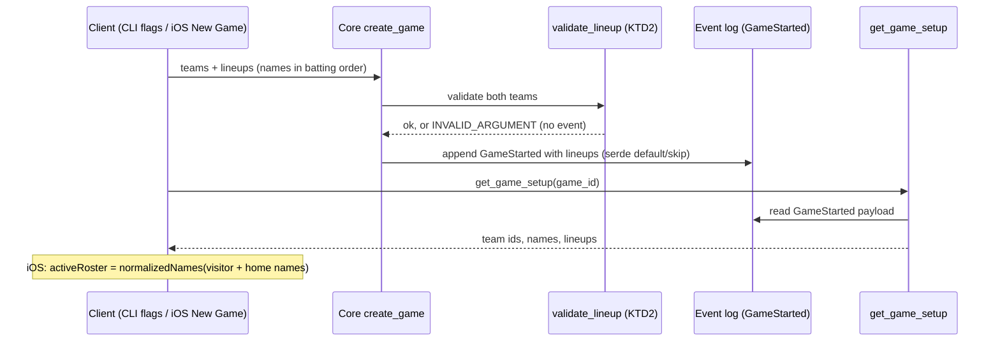

# Game Lineup Through the Core (Agent Parity) - Plan

## Goal Capsule

- **Objective:** An agent or CLI user who starts a game can set each team's batting-order names and read them back, exactly as an iOS scorer does, and the names survive a restart and a replay.
- **Means:** Evolve the core's existing, never-used `LineupSlot` to carry a player name, persist the lineup in the game-started event, and add one read primitive that returns a game's teams and lineups; the CLI and iOS client both use it (KTD1–KTD5).
- **Authority hierarchy:** the constitution (Article II parity, Article VII fail-safe, integer-only core) and FR-029 > Requirements > Key Technical Decisions > unit text.
- **Stop conditions:** stop and surface if (a) old `.dl-state.json` files or the determinism and parity checks cannot stay byte-identical for games without a lineup, (b) the regenerated UniFFI bindings force changes to the existing Swift `createGame` call sites beyond one overload, (c) the owner rejects Assumption A1 (persisting player names before a consent flow exists).
- **Execution profile:** one PR, squad A (core and CLI) with squad B (iOS) touches; Rust first, then bindings, then Swift.
- **Who finishes and ships:** the implementing agent lands the PR through `/ce-code-review` with CI green, including the cargo, CLI, parity, and iOS XCTest hard gates.

---

## Product Contract

### Summary

A game's lineup, the batting-order player names for each team, becomes part of the core's durable game record instead of living only in the iOS screen's memory. Starting a game with names stores them in the game-started event, and a new read returns them. The CLI gains flags to set them and a command to read them. The iOS app reads its active roster back from the core, so speech biasing and name masking use what the core stored.

### Problem Frame

The roster drives speech biasing and parser name masking, but it exists only in `AppState.activeRoster` on iOS. The core already accepts `Team.lineup`, then silently drops it: `create_game` never reads it and the game-started event has no field for it, which contradicts `contracts/create_game.md`. So an agent driving a real game through the CLI can neither set nor read the roster a phone user gets, and a lineup sent through the FFI today vanishes without an error, the exact silent failure Article VII forbids.

### Requirements

**Set and store**

- R1. `create_game` stores each team's supplied lineup in the game-started event, in batting order, and never accepts a lineup it then drops. An ill-formed lineup fails with `INVALID_ARGUMENT` and writes no event.
- R2. A lineup slot needs only a name. Player id and fielding position are optional, so a names-only lineup is valid (FR-001).
- R3. Games without a lineup behave exactly as today: old `.dl-state.json` files load, and a lineup-less game serializes byte-identically.

**Read back**

- R4. A read primitive returns a game's team ids, team names, and lineups, through the CoreApi trait, UniFFI, the CLI, and the Swift `CoreClient`.
- R5. The CLI can set both lineups when starting a game and print them back in a later process; the replay tool builds the same lineup and runs the same validation, so parity holds.
- R6. The iOS active roster comes from the core's read-back, not from the text the scorer typed, and speech biasing and parser masking keep working unchanged.

**Safety**

- R7. Player names stay local: they are not exported (the Retrosheet export keeps its synthetic starters) and are not logged. The persistence of names is recorded against FR-029 (see A1).

### Scope Boundaries

Not in scope: fielding positions in the New Game screen or CLI, mid-game substitutions, editing a lineup after creation, the create-game idempotency dedupe, real names in the Retrosheet export, the placeholder `adapters/agent` crate.

#### Deferred to Follow-Up Work

- **FR-029 consent for players' data.** A verified-parental-consent or opt-in control before storing names that may belong to minors. This needs an owner decision; file an issue and link it from ADR-0020.
- **create_game idempotency.** `create_game` registers its key but never checks it, so a retried create makes a second game. The contract already promises dedupe; fix it separately with its own tests.
- **Retrosheet start records from real lineups.** Once positions exist, the export can emit real names and positions instead of synthetic starters.
- **Local stale-bindings guard.** `tools/ci/ios-xctest.sh` rebuilds the XCFramework only when the simulator slice is missing, so a local run after an FFI change can test stale bindings. CI always starts fresh.

---

## Planning Contract

### Key Technical Decisions

- KTD1. **Evolve `LineupSlot` in place instead of adding a parallel roster field.** The slot gains `name`, and `player_id` and `field_pos` become optional. The data model already defines a lineup slot as a batting-order entry holding a player with a name (`specs/001-voice-scorebook-core/data-model.md`, Team / Lineup / Player). No caller has ever sent `Some(lineup)`, and nothing has been persisted, so the change is lossless. Future positions fill `field_pos` on the same slot. The alternative, a names-only `Team.roster` next to `lineup`, was rejected: it would leave two lineup concepts on an append-only log to reconcile later. This was a judgment on existing evidence, not a bake-off.
- KTD2. **Validation lives in one core function used by `create_game` and the CLI replay tool.** Batting orders must be unique, strictly increasing, and within 1..=20, with gaps allowed, so a slot keeps the number the scorer gave it; at most 20 slots per team, and the DH slot 0 is deferred with positions. Each name is trimmed, must be non-empty, at most 60 characters, and free of control characters. An optional player id must be non-empty, and an optional position must be a valid `Position`. Any violation is `INVALID_ARGUMENT` with the offending team and slot, and no event is written. Clients drop empty text fields before building slots and send each remaining row's own number as its batting order, so blank New Game rows never reach the core and never renumber the others. The CLI's comma list numbers its names 1..=N in order.
- KTD3. **Persist with `#[serde(default, skip_serializing_if = ...)]` on new `GameStartedPayload` fields**, matching the existing idiom on `Team.lineup`. Old state files load, and lineup-less games serialize byte-identically, which the eventlog determinism test and `evals/runners/parity.sh` depend on.
- KTD4. **Read-back is a new primitive, `get_game_setup(game_id)`**, returning team ids, names, and lineups projected from the game-started event. It is not a field on `GameState`. A `GameState` field would ride every write's state preview and change every `dl state` output byte for byte. The read follows the existing read convention: existence check, no authority check. The local state file is the trust boundary, and ADR-0020 says so.
- KTD5. **Name cleanup is split by concern.** The core trims each name and keeps per-team batting order; it does not de-duplicate across teams, because two teams can share a surname. iOS keeps `RosterContextBuilder.normalizedNames` for the flat, case-insensitive, cross-team list that biasing and masking need, applied to the read-back. That also avoids Rust and Swift lowercasing disagreeing.
- KTD6. **Swift keeps every existing `createGame` call compiling** with a protocol-extension overload of the old four-argument signature that forwards empty lineups. The new requirement takes two optional name lists. `DiamondCoreClient` builds slots from names, then calls the read and returns the setup in the Swift `CreateGameResult`. So every iOS game exercises the persisted path, and `MockCore` becomes stateful: it stores and returns the setup.

### High-Level Technical Design

### Assumptions

Scoping confirmation was skipped (`confirm:auto`); these are unconfirmed bets.

- A1. Persisting player names before an FR-029 consent flow exists is acceptable for v1 as a knowing, recorded exception. The facts behind it: the players named may be minors (A2) whatever the owner's age, because the iOS age gate checks only the owner; neither the CLI nor the core has any age or consent check; the only at-rest store is the CLI's `.dl-state.json`, since the iOS core is in memory; names are never exported or logged; and R4/R5 deliberately let any agent read them through `get_game_setup` or `dl setup`, including hosted-model agents that send them off the device. The owner must confirm this with the exposure stated, before merge; otherwise stop condition (c) applies.
- A2. Twenty names per team covers continuous-batting youth lineups; the New Game screen collects nine.
- A3. Sixty characters per name is enough for real player names.
- A4. The CLI's comma-separated form, matching `dl-score --roster`, is acceptable; a name containing a comma cannot be expressed on the CLI.

### Sequencing

U1 first; it defines the stored shape. U2 and U3 depend on U1 and can run in parallel, because U2 touches only Rust and shell and U3 touches only Swift, after the bindings are regenerated from U1.

---

## Implementation Units

### U1. Core: lineup in the event, validation, and the setup read

**Goal:** The core stores a validated lineup and returns it through a new read.

**Requirements:** R1, R2, R3, R4, R7.

**Dependencies:** none.

**Files:**
- `core/src/ffi.rs` (modify: `LineupSlot` per KTD1, new `GameSetup` record, `CoreApi::get_game_setup`, doc on `Team`).
- `core/src/eventlog/mod.rs` (modify: lineup fields on `GameStartedPayload` per KTD3).
- `core/src/primitives/mod.rs` (modify: validation per KTD2, persist in `create_game`, `get_game_setup`, `ffi_get_game_setup` wrapper, the method-count comment, a cross-reference comment at the synthetic Retrosheet starters per R7).
- `core/tests/lineup_setup.rs` (create), plus the three `Team { … }` literals in `core/tests/` and the `GameStartedPayload` literals in eventlog tests.
- `core/tests/fixtures/pre-lineup-snapshot.json` (create: a snapshot from before this change).
- `specs/001-voice-scorebook-core/contracts/create_game.md`, `contracts/get_game_setup.md` (create), `contracts/README.md`, `data-model.md`, `ios/Generated/README.md` mapping table.
- `DECISIONS.md` (ADR-0020: KTD1–KTD5, the FR-029 note, the no-authority read, the deferred idempotency gap).

**Approach:**
1. Evolve the slot and add the setup record, both with the existing snake_case serde and `cfg_attr(uniffi)` pattern; mark new optional fields for UniFFI defaults if 0.28 allows it without breaking the generated initializer.
2. Add one `validate_lineup` function per KTD2; call it before any authority or log write in `create_game`.
3. Persist trimmed slots on `GameStartedPayload`; `get_game_setup` finds the game's `GameStarted` row and returns its payload, or `NOT_FOUND`.

**Patterns to follow:** the `Team.lineup` serde attributes; the existing reads `get_game_state` and `list_game_events`; the snake_case wire test in the primitives tests module.

**Test scenarios:**
- Creating a game with a nine-name visitor lineup and no home lineup returns the same names in order from `get_game_setup`, with no player ids or positions.
- A lineup of names with surrounding spaces is stored trimmed.
- Batting orders 1, 2, 5 are accepted and stored as given.
- An empty-after-trim name, a 61-character name, a name with a control character, 21 slots, a batting order of 21, a duplicate batting order, batting orders out of order, and a position of 10 each fail with `INVALID_ARGUMENT` naming the team and slot, and the event log length is unchanged.
- A game created with no lineups serializes its `GameStarted` event byte-identically to the pre-change fixture.
- The pre-lineup snapshot fixture restores, and `get_game_setup` returns both teams with empty lineups.
- Two teams may carry the same name, and both are stored.
- `get_game_setup` on an unknown game id is `NOT_FOUND`.
- The wire JSON for a slot uses snake_case keys and omits absent optional fields.
- The eventlog determinism test and the no-float clippy gate still pass.

**Verification:** cargo tests and the `--features uniffi` clippy gate pass; `make uniffi-bindings` produces non-empty Swift with the new read.

### U2. CLI and parity

**Goal:** An agent sets lineups on the CLI, reads them back in another process, and the parity check covers them.

**Requirements:** R5, R3.

**Dependencies:** U1.

**Files:**
- `adapters/cli/src/main.rs` (modify: optional `--visitor-roster` and `--home-roster` trailing flags on `new-game`, a `setup <game-id>` read command, optional `visitor_roster` and `home_roster` strings on `ReplayOp::NewGame`, and a `replay-core --setup` mode that prints the last game's setup).
- `adapters/cli/tests/persistence.rs` (modify: cross-process round trip, old-state-file load, rejection cases).
- `evals/runners/parity.sh` (modify: keep the state diff and add a second diff, `dl setup` on the persisted CLI game against `dl replay-core --setup`, for a game created with a lineup).
- `specs/001-voice-scorebook-core/quickstart.md` (modify: the documented `new-game` form matches the binary).

**Approach:**
1. Keep the positional `new-game <home> <visitor> <owner>` form; parse the two optional flags after it, split on commas, trim, and drop empties, matching `dl-score --roster`.
2. `setup` prints `GameSetup` as pretty JSON, like `dl state`.
3. The replay tool's new-game step parses its roster strings with the same helper as `new-game`, then the core validates them, so both paths build the same lineup; `replay-core` runs a fresh in-memory core, so its setup must be printed in the same process by `--setup`.

**Patterns to follow:** `dl state` for the read command; `dl-score --roster` parsing in `ios/Sources/DLScore/DLScore.swift`.

**Test scenarios:**
- `dl new-game Hawks Owls owner-1 --visitor-roster "Ana Ruiz, Ben Ortiz"`, then `dl setup <id>` in a separate process prints both names in order for the visitor team.
- A state file written before this change loads, and `dl setup` on its game prints empty lineups.
- A 61-character name on the CLI exits non-zero with the invalid-argument code and writes no state change.
- `dl new-game` with no roster flags prints the same output as before.
- The parity check passes with a lineup in both the CLI and replay paths.
- A replay op that omits the lineup makes the parity setup diff fail, proving the check can go red.

**Verification:** CLI tests and `evals/runners/parity.sh` pass.

### U3. iOS: regenerated bindings, client, and roster read-back

**Goal:** The iOS app creates games with lineups through the core and takes its active roster from the read-back.

**Requirements:** R4, R6.

**Dependencies:** U1.

**Files:**
- `ios/Sources/Core/CoreClient.swift` (modify: lineup-taking `createGame` requirement, old-signature overload per KTD6, `GameSetup` type, `gameSetup(gameId:)` read, `CreateGameResult.setup`).
- `ios/Sources/Core/DiamondCoreClient.swift` (modify: names to slots, call the setup read after create).
- `ios/Sources/Core/MockCore.swift` (modify: store and return setups per game).
- `ios/Sources/UI/App/AppState.swift` (modify: `activeRoster` from `result.setup` through `normalizeRoster(visitor + home)`; doc comment).
- `ios/Tests/T177LineupParityTests.swift` (create); `ios/Tests/T157PushToTalkWiringTests.swift` (modify only if its roster assertions need the new source).

**Approach:**
1. Regenerate the bindings with `make xcframework`, delete-before-regenerate (ADR-0009), before building; the local test script does not detect stale bindings.
2. Qualify generated names that collide with the Core module's own types, as `DiamondCoreClient` already does.

**Execution note:** start with the real-core round-trip test through `DiamondCoreClient`; it is the test a stateless mock cannot fake.

**Test scenarios:**
- Through `DiamondCoreClient` on the real core, creating a game with visitor names "Ana Ruiz" and "  Ben Ortiz " returns a setup whose visitor lineup is "Ana Ruiz", "Ben Ortiz" in order.
- `AppState.createGame` with lineups sets `activeRoster` from the core's setup: a `MockCore` that returns a setup differing from the typed text makes `activeRoster` follow the core, not the text.
- New Game rows #1, #2 and #5 filled, the rest blank, store batting orders 1, 2 and 5 for those names, and a game with all rows blank starts with empty lineups.
- A home and visitor lineup that share "ana ruiz" yield one roster entry, keeping the existing cross-team de-duplication.
- The existing four-argument `createGame` call sites still compile and create lineup-less games.
- A core rejection of a lineup surfaces the existing create-game error path, and no game starts.

**Verification:** `make ios-test` passes with the new tests; the privacy gate stays green.

---

## Verification Contract

- cargo tests, the `--features uniffi` clippy gate, and `make uniffi-bindings`.
- CLI tests and `evals/runners/parity.sh`.
- `make ios-test` after `make xcframework` (the CI iOS hard gate).
- `evals/runners/transcript-score.sh` and `evals/runners/voice-accuracy.sh` unchanged and green (`dl-score` output must not change).
- `/ce-code-review`, with attention to the persisted event schema and the FR-029 note.

## Definition of Done

- U1–U3 landed; CI fully green.
- A lineup sent through any surface is stored or rejected, never dropped.
- The owner's explicit confirmation of A1, with the exposure it states, recorded in the PR before merge.
- ADR-0020 merged, stating the same A1 facts and linking the FR-029 consent and create-game idempotency follow-up issues.
- `contracts/create_game.md`, `contracts/get_game_setup.md`, `data-model.md`, and `quickstart.md` match the code.
- #177 closed.

## Sources & Research

- `docs/solutions/best-practices/uniffi-integration-gotchas.md`: variable-length lists only; use the existing bindgen scripts.
- `docs/solutions/integration-issues/mock-to-real-stateful-core-swap.md`: why `MockCore` must be stateful and the round trip must run on the real core.
- `docs/solutions/workflow-issues/parallel-squad-integration.md`: verify snake_case on the new wire fields; recheck the ADR number before merge.
- `docs/solutions/best-practices/derived-export-must-match-canonical-projection.md`: the export's synthetic starters and why R7 keeps them deliberately.
